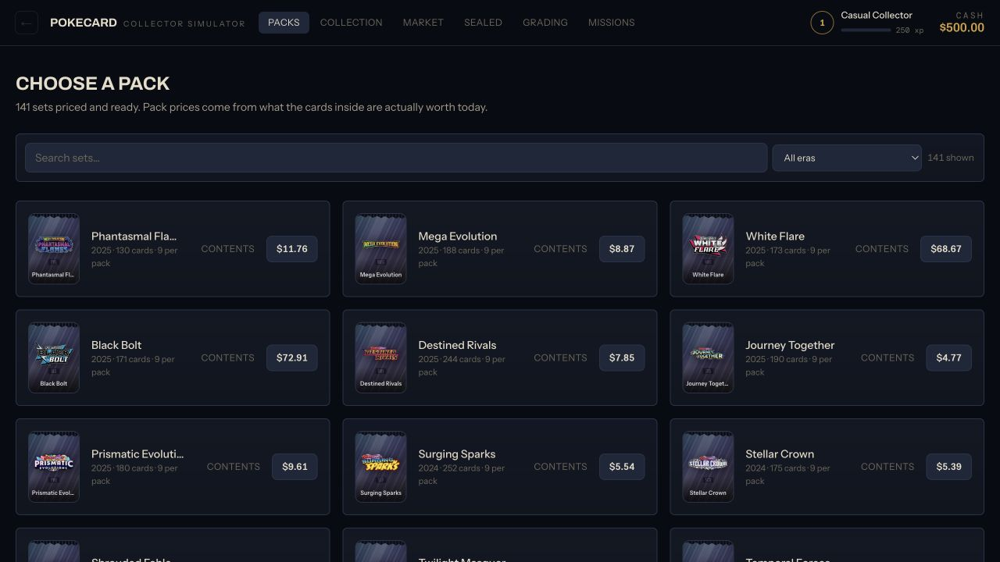
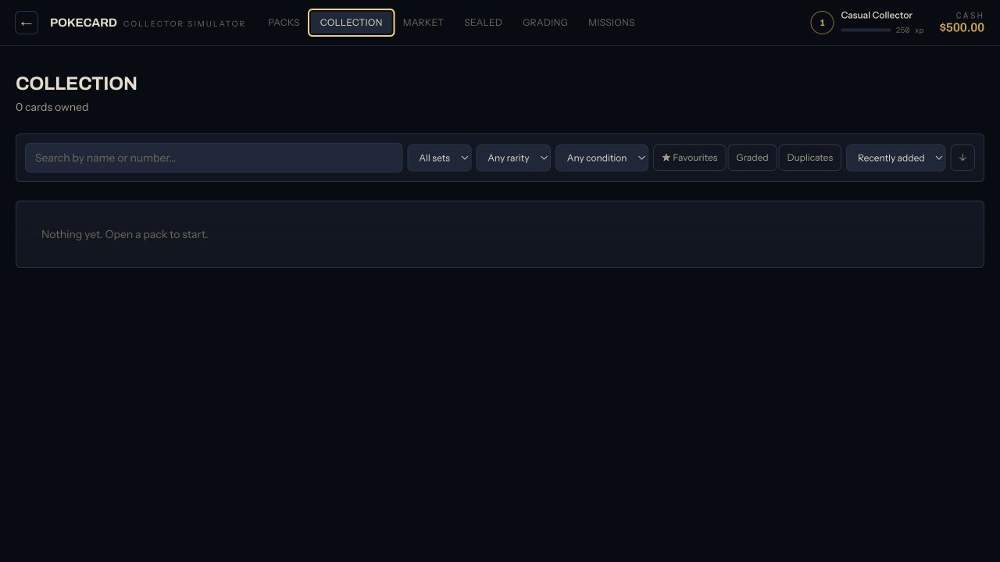

# PokeCard Simulator

> A collector-first Pokémon TCG life simulator where opening a pack is only the beginning.

PokeCard Simulator turns the familiar thrill of a booster opening into a full collector loop. Build an album from real catalogue data, decide which cards to keep, sell, grade, or list on the market, and weigh the temptation to rip sealed product against the value of holding it. There is no real-money spending: every decision happens inside a simulated, auditable economy.

The project is deliberately built as a game system, not a card gallery. Pack pulls, prices, grades, balances, progression, and inventory all have rules, persistence, and consequences.

## In the app



The pack browser presents a broad catalogue without losing the feeling of browsing a display case: search and era filters narrow the sets, while each item carries its own wrapper treatment, card count, pack size, and simulator price.



The collection is designed as an album workspace rather than a raw inventory dump. Its filters, quick views, and sorting stay useful from the first pull through duplicate management, grading, and set completion.

## What you can do

- **Open packs** from data-backed sets with slot-based pull logic and a paced reveal flow.
- **Build a collection** with searchable, filterable ownership, condition, rarity, favourite, duplicate, and grading views.
- **Trade intelligently** through an NPC dealer or a player-facing market stall with asking prices, wait estimates, fees, and sale history.
- **Grade cards** by choosing a service tier, accepting turnaround time and fees, and collecting a server-decided result.
- **Hold or open sealed product**: a deliberately uncertain investment loop with current value, buy offer, and the option to break it into packs.
- **Progress as a collector** through XP, level titles, unlocks, and mission rewards that favour completing a set over endlessly opening packs.

## Tech used

| Area | Technology | Why it is here |
| --- | --- | --- |
| Web app | Next.js 16, React 19, TypeScript | App Router UI with server route handlers for game actions. |
| UI & motion | Tailwind CSS 4, Framer Motion, GSAP, Lucide | A responsive vitrine-style interface with tactile pack and card interactions. |
| Data layer | Drizzle ORM, PostgreSQL | Typed schema, migrations, and portable SQL. |
| Local / production database | PGlite / Neon | Local Postgres in WebAssembly; switch to Neon with `DATABASE_URL` and no query rewrite. |
| Card catalogue & pricing | Pokémon TCG Data bulk JSON and Pokémon TCG API | Set metadata, card records, image references, and market inputs. |
| Game engines | Workspace TypeScript packages | Pack simulation and economy rules stay pure, deterministic, and independently testable. |
| Quality checks | Vitest and a 100k-opening simulation harness | Unit coverage for rules plus statistical validation of pack distributions. |

## Architecture

The repository is a small monorepo with explicit boundaries. The web app orchestrates requests; game rules live in packages that can be tested without a browser or database.

```text
apps/web
  UI, route handlers, session and game services
        |
        +--> @pcs/card-data      catalogue queries and price selection
        +--> @pcs/pack-engine    pure seeded pack simulation
        +--> @pcs/economy-engine pure pricing, grading, market and ledger rules
        +--> @pcs/db             Drizzle schema and PGlite / Neon connection
        +--> @pcs/shared         domain types: cents, rarity tiers, confidence
```

| Package | Owns | Does not own |
| --- | --- | --- |
| `@pcs/shared` | Branded money types, rarity normalization, confidence metadata | I/O or game side effects |
| `@pcs/card-data` | Catalogue access, set eras, price selection | Accounts and player state |
| `@pcs/pack-engine` | Templates, pull tables, seeded selection, expected pack value | React, database, or money movement |
| `@pcs/economy-engine` | Price factors, dealer spreads, grading, market events, progression, ledger operations | Images and UI |
| `@pcs/db` | Schema, migrations, and connection driver | Business rules |
| `apps/web` | Screens, route handlers, sessions, and orchestration | Client-controlled economic outcomes |

## Core game logic

### Server-authoritative outcomes

The client only asks to open a set, sell a specific inventory item, submit a card for grading, or buy sealed product. The server validates the player, computes the price, performs the rule outcome, updates inventory, and returns the result. A browser never submits its own pull, grade, price, or balance.

### Deterministic pack simulation

Each set is represented by a versioned template made of slots and pull tables. A seeded random generator selects from the real composition of that set, honours distinct-card groups, and keeps reverse-holo eligibility separate from regular slots. The stored seed hash and template version make an opening auditable without exposing a future result.

Pack prices are derived from the *expected contents of the actual slots*, not a naïve set-wide average or historical MSRP. That avoids vintage-card inflation creating an infinite-money loop while preserving the intended house edge.

### Money that can be audited

Money is integer **cents** throughout the application—never floating point. Every economic action goes through one atomic ledger operation: it locks the player balance, rejects an overdraft, updates the balance, and writes a transaction row with the resulting balance. The balance can then be recomputed from the ledger to detect drift.

### Honest uncertainty

Source pull rates and prices carry a confidence level. Only official or manufacturer-published pull rates are presented as exact; the rest are deliberately labelled as estimates. Raw source rarities are normalized into stable gameplay tiers, so mechanics never depend on inconsistent era-specific rarity names.

## Product and visual design

The visual direction is a restrained collector's vitrine: ink-dark surfaces, hairline seams, brass highlights, warm paper-like type, compact mono numerals for value, and set-specific colour sampled from the product artwork. It treats cards and packs as objects worth lingering on rather than generic ecommerce tiles.

Key interface choices include:

- A persistent header keeps cash, level, and navigation visible throughout the game loop.
- Pack artwork uses foil, crimped seals, and set identity instead of interchangeable thumbnail cards.
- Values, progress, and market decisions use tabular figures so comparisons are easy to scan.
- Pack reveal, card detail, price charts, slabs, completion bars, and “new card” markers turn state changes into clear feedback.
- The responsive shell has a mobile menu and a skip-to-content link; controls use labels and accessible button states.

For the longer product rationale, data model, balance philosophy, and roadmap, read [`docs/DESIGN.md`](docs/DESIGN.md). Repository rules and non-negotiable invariants live in [`AGENTS.md`](AGENTS.md).

## Data and attribution

Catalogue records and image URLs come from [Pokémon TCG API](https://pokemontcg.io) and [PokemonTCG/pokemon-tcg-data](https://github.com/PokemonTCG/pokemon-tcg-data). Market inputs are TCGplayer and Cardmarket figures surfaced by the API. Images are accessed through an asset indirection so the application can move to its own storage later without changing gameplay code.

This is a non-commercial fan project. Pokémon and all card content are © Nintendo / Creatures Inc. / GAME FREAK inc. / The Pokémon Company. No real currency is used, and the simulator does not provide real-world card-value advice or predictions.

## Installation

Requires Node.js 20 or newer. No Docker or separate Postgres installation is needed for local development.

```bash
npm install
npm run db:push
npm run data:all
npm run dev
```

Open `http://localhost:3000` once the server is ready.

Useful commands:

| Command | Purpose |
| --- | --- |
| `npm run dev` | Start the web app. |
| `npm run build` | Create a production build. |
| `npm run db:push` | Apply the schema to the configured database. |
| `npm run db:reset` | Reset the local PGlite database. |
| `npm run data:all` | Import sets, cards, prices, pack prices, and sealed-market data. |
| `npm run data:validate` | Run the catalogue data-quality report. |
| `npm run simulate` | Run 100,000 simulated openings and check pack distributions. |
| `npm test` | Run unit and statistical tests. |

PGlite allows one process to own `data/pgdata` at a time. Stop the development server before running any `data:*` import command. If a local database is ever interrupted or corrupted, rebuild it with `npm run db:reset && npm run db:push && npm run data:all`.
