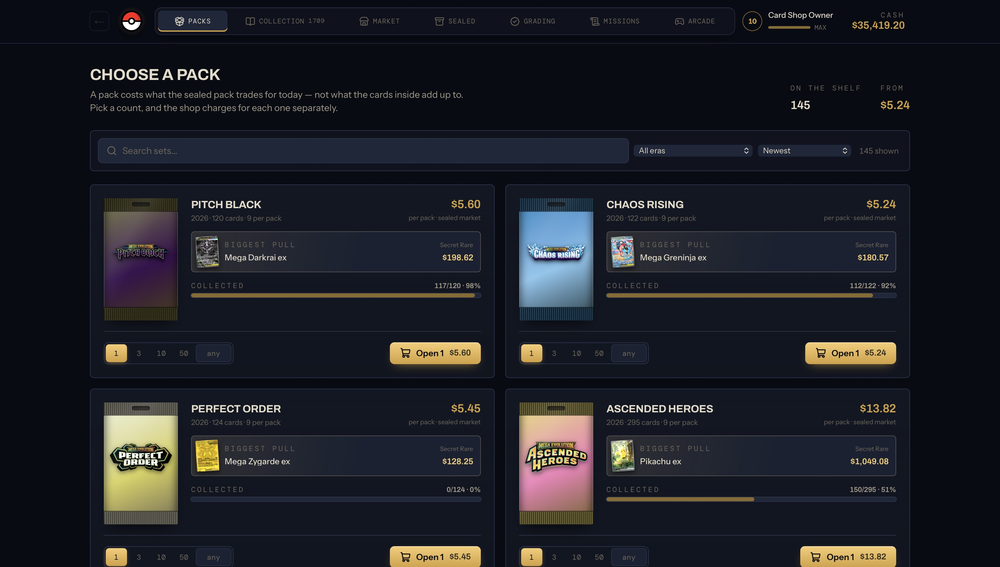
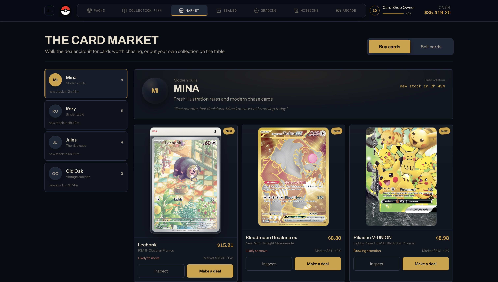
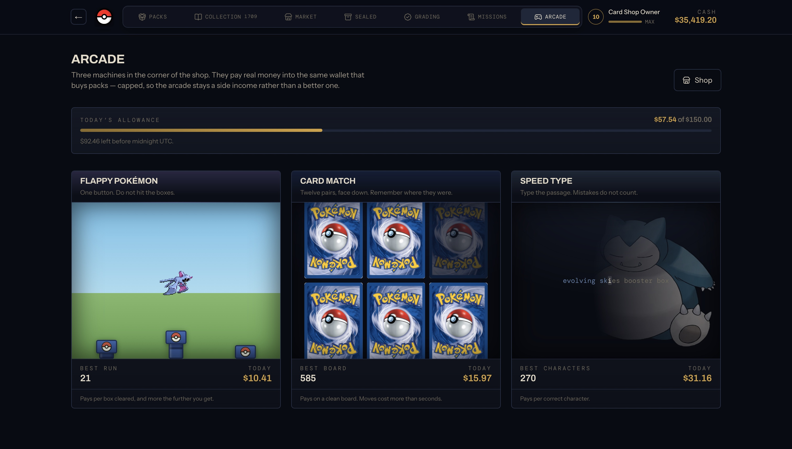

# PokeCard Simulator

A Pokémon TCG collection simulator built around pack opening, card ownership, trading, grading, progression, and a persistent virtual economy. No real money is used.

## Screenshots

| Packs | Collection |
| --- | --- |
|  |  |

| Market | Arcade |
| --- | --- |
|  |  |

## Features

- **Pack opening:** data-backed sets, sealed-market prices, set-specific wrappers, multi-pack purchases, deterministic pull tables, and animated reveals.
- **Collection:** per-copy inventory, search and filters, favourites, duplicates, conditions, graded slabs, set completion, and value sorting.
- **Card market:** persistent NPC dealers, rotating stock, graded cards, negotiation, counteroffers, anger, and card-plus-cash trades.
- **Player sales:** listings, fees, buyer visits, sale history, and server-settled proceeds.
- **Grading and sealed products:** service tiers, turnaround times, server-decided grades, sealed inventory, and hold-or-open decisions.
- **Arcade:** Flappy Pokémon, Card Match, and Speed Type with cosmetics, verified runs, and a shared daily earnings cap.
- **Progression:** XP, collector levels, missions, rewards, and a finance dashboard backed by the transaction ledger.

## Tech

| Layer | Stack |
| --- | --- |
| Frontend | Next.js 16, React 19, TypeScript, Tailwind CSS 4 |
| Interaction | Framer Motion, GSAP, Lucide |
| Backend | Next.js route handlers, Drizzle ORM, PostgreSQL |
| Database | Supabase Postgres; PGlite for explicit local mock mode and isolated tests |
| Data | PokemonTCG bulk data, TCGplayer and Cardmarket pricing inputs |
| Testing | Vitest, TypeScript checks, deterministic simulations, and a 100,000-pack probability harness |

## Architecture

```text
apps/web
  UI, API routes, sessions, server orchestration
      |
      +-- @pcs/pack-engine       seeded pack generation
      +-- @pcs/economy-engine    pricing, grading, trading, progression
      +-- @pcs/minigame-engine   run validation, payouts, cosmetics
      +-- @pcs/card-data         catalogue and market data
      +-- @pcs/db                schema, migrations, connections
      +-- @pcs/shared            money and domain types
```

The browser submits an action, never its outcome. The server calculates pulls, prices, grades, trades, rewards, and balances, then persists the result atomically.

- Money is stored as integer cents.
- Every balance change writes a transaction with the resulting balance.
- Pack openings use versioned templates and private seeds.
- Physical duplicates are tracked by inventory item, so each copy can be sold or graded independently.
- Arcade runs use single-use tokens, plausibility limits, and server-side settlement.
- Non-official rates and prices are labelled as estimates.

## Data and attribution

Catalogue data and card images come from [Pokémon TCG API](https://pokemontcg.io) and [PokemonTCG/pokemon-tcg-data](https://github.com/PokemonTCG/pokemon-tcg-data). Market inputs include TCGplayer and Cardmarket data.

This is a non-commercial fan project. Pokémon and all card content are © Nintendo / Creatures Inc. / GAME FREAK inc. / The Pokémon Company.

## Installation

Requires Node.js 20+ and a PostgreSQL connection. Normal development uses the configured Supabase project.

```bash
npm install
```

Create an ignored `.env.local` in the repository root:

```dotenv
DATABASE_URL=your_supabase_postgres_connection_string
```

Then initialize and start the app:

```bash
npm run db:push
npm run data:all
npm run dev
```

For an isolated local PGlite database, use `npm run dev:mock`. Only one process can access `data/pgdata`; stop the mock server before running database or import scripts.
